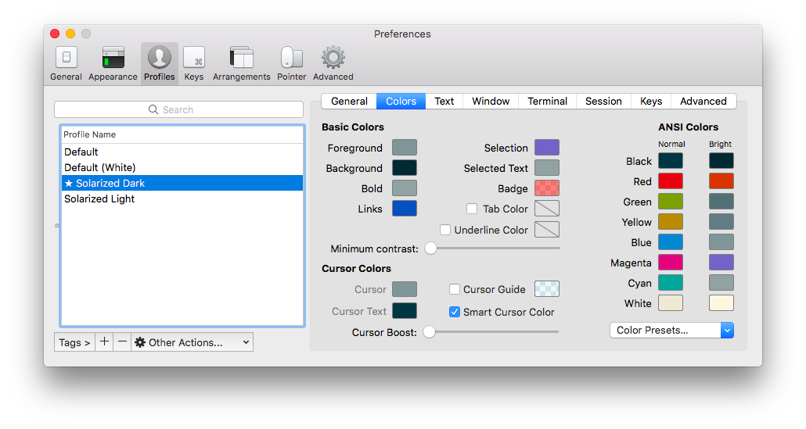

# vimfiles

This is a fully-fledged Neovim configuration, ready to go for Ruby, Rails,
JavaScript, and JSX, as well as other languages such as Elm, Haskell, and
Clojure.

## What's inside

### Handy plugins

This configuration comes with a boatload of plugins for various use cases and
languages, but here are the most important ones:

* [VimPlug][vim-plug] — a fast plugin manager
* [NERDTree][vim-nerdtree] — a simple file tree
* [Ctrl-P][vim-ctrl-p] — a fuzzy file finder for quickly jumping to files
* [Ack][vim-ack] + [Ag][ag] — a way to search across a project lightning quick
* [NERDCommenter][vim-nerdcommenter] — an easy way to comment and uncomment
  lines
* [SuperTab][vim-supertab] — an autocompleter that stays out of your way
* [Ale][ale] — an asychronous code linter that works with a bunch of languages
  (and can also autoformat files in languages that support it)
* [endwise][vim-endwise] — automatically adds `end` to a Ruby block in a
  non-intrusive manner
* [AutoPairs][auto-pairs] — adds matching parentheses, braces, brackets, and
  quotes as you type them (but can be toggled on/off as needed)
* [indentLine][indentLine] — adds vertical lines at regular indentation levels
  so that you can quickly tell if a line is misindented
* [surround][vim-surround] — a way to quickly surround text with quotes,
  parentheses, braces, etc.
* [togglecursor][vim-togglecursor] — makes insert and command modes more
  obvious by switching the cursor
* [vim-textobj-rubyblock][vim-textobj-rubyblock] — adds Ruby blocks as text
  objects so that they can be manipulated and selected just like words,
  paragraphs, etc.
* [vim-css-color][vim-css-color] — highlights hex color strings in CSS files
  with the actual colors that they represent

[vim-plug]: https://github.com/junegunn/vim-plug
[vim-nerdtree]: http://github.com/scrooloose/nerdtree
[vim-ctrl-p]: http://github.com/kien/ctrlp.vim
[vim-ack]: https://github.com/mileszs/ack.vim
[vim-supertab]: http://github.com/ervandew/supertab
[vim-togglecursor]: https://github.com/jszakmeister/vim-togglecursor
[vim-nerdcommenter]: http://github.com/scrooloose/nerdcommenter
[vim-endwise]: https://github.com/tpope/vim-endwise
[vim-surround]: http://github.com/tpope/vim-surround
[vim-textobj-rubyblock]: http://github.com/nelstrom/vim-textobj-rubyblock
[ale]: https://github.com/w0rp/ale
[indentLine]: https://github.com/Yggdroot/indentLine
[auto-pairs]: https://github.com/eapache/auto-pairs

### Sensible defaults

* Lines in files of most filetypes are hard-wrapped to 80 characters
* The system clipboard is used for copying/pasting
* Incremental search provides more feedback than the default search behavior
* `Rakefile`, `Gemfile`, and `*.gemspec` files are highlighted as Ruby files
* `.jshintrc` and `.eslintrc` are highlighted as JSON files

### Sensible mappings

* `,` is the leader key (so no finger gymnastics)
* `Ctrl-{H,J,K,L}` lets you navigate to windows in Vim *and to panes in tmux*
* `j` and `k` always place the cursor one line below or above, regardless of
  whether lines are being wrapped
* `%` bounces between the start and end of blocks (in languages that make it
  possible to do so)
* `<` and `>` no longer lose drop the selection when indenting a selected block
  of text
* `Q` lets you reformat paragraphs

## Making this your own

### Prerequisites

Want this configuration for yourself? There are a few things you'll need first.

#### Neovim

First, this configuration assumes you're using Neovim. You can install this
using Homebrew:

    brew install neovim

If you're using my [dotfiles][dotfiles], you're good to go here. Otherwise,
you'll want to keep in mind that you can use `nvim` to start Neovim. Since this
is non-standard, I recommend adding a couple of aliases to your shell:

    alias vim="nvim"
    alias vi="nvim"

[dotfiles]: http://github.com/mcmire/dotfiles

#### iTerm

Next, you'll need to install iTerm if you don't already have it. Once you have
it, you'll want to drop into Preferences and make three changes:

##### Color scheme

In this configuration, Vim uses [Solarized] as its color scheme. Solarized is a
lovely color scheme as it has been finely crafted with **science** (okay,
light/perception theory) so that the difference between its dark and light modes
are only a few colors. In order to prevent your colors in Vim from looking off,
you'll need to configure iTerm to use Solarized as well.

To do this, first, download the color scheme files [here][solarized]. Look for a
directory that corresponds to iTerm, then double-click on the color scheme files
(dark *and* light).

This will install the color scheme files, but now we need to apply them. The
best way to do this is to click on the Profiles tab and create two new iTerm
profiles, one called Solarized Light, the other called Solarized Dark. Now you
can go into each profile, click on the Colors tab, and select a color preset.

##### Font

Now that you have two profiles, go into each one and configure them to use [Fira
Code] as the font. Fira Code is a font where combinations of symbols that are
frequently used in code (`->`, `...`, and `|>`, just to name a few) are
implemented as ligatures. This means that they appear as one character instead
of multiple characters, thereby making it easier to scan code. Fira Code also
works perfectly with Powerline/Airline, so you don't have to bother with any
modified fonts such as [these][powerline-fonts].

[Solarized]: https://github.com/altercation/solarized
[Fira Code]: https://github.com/tonsky/FiraCode
[powerline-fonts]: https://github.com/Lokaltog/powerline-fonts

#### Ag (aka the Silver Searcher)

Vim is configured to use [Ag][ag] for fuzzy file finding, so you'll also need
this as well. You can install it with Homebrew:

[ag]: https://github.com/ggreer/the_silver_searcher

    brew install ag

If you already have Ag, make sure you're on a recent version. You can upgrade by
saying:

    brew upgrade ag

#### Ruby support

Neovim no longer includes Ruby support, so you'll need to install it.
You can do that with:

    gem install neovim

#### Python support

Neovim no longer includes Python support. You can install this with:

    pip install neovim

NOTE: This assumes you have pip installed. As new Macs do not include pip, you
will want to [do that first][installing-python].

[installing-python]: http://github.com/mcmire/dotfiles#python

### Running the install script

Now that you have the prerequisites out of the way, you can actually install
these configuration files and get started vimming.

First, you need to download this repo somehow. My goal is to get you on a path
to creating your own vimfiles, so I would recommend forking this repo so that
you can push up changes to it later. Clone your fork in a convenient place
you'll remember, such as the same place you store code:

    cd ~/your-code-directory
    git clone git://github.com:yourusername/vimfiles.git

If you already installed Vim at some point in the past, then you'll want to make
sure you remove all of those configuration files first. At a minimum, you'll
want to run:

    mv ~/.vim ~/.vim.old
    mv ~/.vimrc ~/.vimrc.old

Next, run the install script that comes bundled with this repo. Since you forked
the repo, it's best that you install all of the files here as *symlinks*. This
will allow you to edit them *either* directly *or* through your forked repo
location:

    script/install --link

### Post-installation

You're almost there! Now you're ready to install plugins. You can do that by
opening `vim` and by running:

    :PlugInstall

(You may see errors that a plugin failed to be cloned or installed, but if you
press R to restart the installation then it should report a success.)

Now close Vim and re-open it, and you should be good to go!

### You're done!

Enjoy your shiny new Vim installation!
