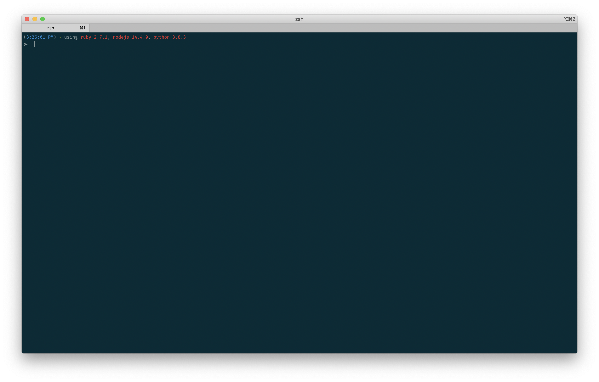

# dotfiles

This repo is designed to set up a Mac for development.
It is updated very frequently!

## [What's in the box?][se7en]

[se7en]: https://youtu.be/1giVzxyoclE?t=122

### Terminal-based tools

* **zsh** — the new standard in shells
* **[iTerm]** — a more capable terminal emulator
* **[tmux]** — corral projects and their many sessions
* **[Neovim]** — a slimmer and more modern fork of Vim
  ([More details →](#neovim-configuration))
* **[Git]** — the king of version control software
* **[tig]** — a semi-graphical UI for git
* **[asdf]** — the one language version manager to rule them all
* **[autojump]** — no more setting up aliases to jump directly to projects
* **[fzf]** — a faster and more pleasant version of `Ctrl-R`
* **[direnv]** — automatically load `.env` files in projects
* **[heroku]** — interact with Heroku-deployed apps

[tmux]: https://github.com/tmux/tmux/wiki
[iTerm]: https://www.iterm2.com/
[Neovim]: https://neovim.io/
[Git]: https://git-scm.com/
[tig]: https://jonas.github.io/tig/
[asdf]: https://asdf-vm.com/
[autojump]: https://github.com/wting/autojump
[fzf]: https://github.com/junegunn/fzf
[direnv]: https://direnv.net/
[ngrok]: https://ngrok.com/
[heroku]: https://github.com/heroku/cli

### Applications

* **[Chrome]** — still has the best devtools
* **[1Password]** — the easiest password manager
* **[Simplenote]** — highly performant, write-anywhere, dead simple note-taking tool
* **[Notion]** — sophisticated create-your-own human knowledge vault
* **[Dash]** — search documentation for all kinds of programming languages
* **[Moom]** — control placement of your windows using keybindings
* **[Stay]** — remembers window placement when connecting and discnnnecting monitors
* **[Numi]** — a fancy calculator app without any fancy buttons

[Chrome]: https://www.google.com/chrome/
[1Password]: https://1password.com/
[Simplenote]: https://simplenote.com/
[Notion]: https://notion.so
[Dash]: https://kapeli.com/dash
[Moom]: https://manytricks.com/moom/
[Stay]: https://cordlessdog.com/stay/
[Numi]: https://numi.app/

### MacOS customization

* Use `~/Screenshots` to save screenshots instead of the desktop
* Disable auto-capitalization,
  smart characters,
  auto-correct,
  spell check,
  and grammar check
* Disable press-and-hold for keys
* Speed up keyboard repeat rate
* Use Caps Lock for Escape for Vim
* Make the Function key functional
* Disable most trackpad gestures
* Enable filename extensions by default in Finder
* Use plain text mode for TextEdit
* Allow tmux to access the clipboard by default
* Configure Moom so you can fully maximize any window with Cmd-F

### Neovim configuration

Neovim is preconfigured with the following features:

#### Handy plugins

* **[VimPlug][vim-plug]** — a fast plugin manager
* **[NERDTree][vim-nerdtree]** — a simple file tree
* **[Ctrl-P][vim-ctrl-p]** — a fuzzy file finder for quickly jumping to files
* **[Ack][vim-ack] + [Ag][ag]** — a way to search across a project lightning quick
* **[NERDCommenter][vim-nerdcommenter]** — an easy way to comment and uncomment lines
* **[SuperTab][vim-supertab]** — an autocompleter that stays out of your way
* **[CoC][coc]** — brings Vim closer to an IDE-like experience
  with autocompletion, documentation, linting, and formatting
  (works best with language servers like TypeScript)
* **[AutoPairs][auto-pairs]** —
  adds matching parentheses, braces, brackets, and quotes as you type them
  (but can be toggled on/off as needed)
* **[endwise][vim-endwise]** — like AutoPairs but for Ruby blocks
* **[indentLine][indentLine]** —
  adds vertical lines at regular indentation levels
  so that you can quickly tell if a line is misindented
* **[surround][vim-surround]** —
  a way to quickly surround text with quotes,
  parentheses, braces, etc.
* **[togglecursor][vim-togglecursor]** —
  makes insert and command modes more obvious
  by switching the cursor when switching modes
* **[FastFold][fast-fold]** —
  makes it actually possible to use `foldmethod=syntax` in Ruby files
  without slowing Vim down to a halt
* ...and more!

[vim-plug]: https://github.com/junegunn/vim-plug
[vim-nerdtree]: http://github.com/scrooloose/nerdtree
[vim-ctrl-p]: http://github.com/kien/ctrlp.vim
[vim-ack]: https://github.com/mileszs/ack.vim
[ag]: https://github.com/ggreer/the_silver_searcher
[vim-supertab]: http://github.com/ervandew/supertab
[vim-togglecursor]: https://github.com/jszakmeister/vim-togglecursor
[vim-nerdcommenter]: http://github.com/scrooloose/nerdcommenter
[vim-endwise]: https://github.com/tpope/vim-endwise
[vim-surround]: http://github.com/tpope/vim-surround
[vim-textobj-rubyblock]: http://github.com/nelstrom/vim-textobj-rubyblock
[coc]: https://github.com/neoclide/coc.nvim
[indentLine]: https://github.com/Yggdroot/indentLine
[auto-pairs]: https://github.com/eapache/auto-pairs
[fast-fold]: https://github.com/Konfekt/FastFold

#### Sensible defaults

* Lines in files of most filetypes are hard-wrapped to 80 characters
* The system clipboard is used for copying/pasting
* Incremental search provides more feedback than the default search behavior
* `Rakefile`, `Gemfile`, and `*.gemspec` files are highlighted as Ruby files
* `.jshintrc` and `.eslintrc` are highlighted as JSON files

#### Sensible mappings

* `,` is the leader key (so no finger gymnastics)
* `Ctrl-{H,J,K,L}` lets you navigate to windows in Vim *and to panes in tmux*
* `j` and `k` always place the cursor one line below or above, regardless of
  whether lines are being wrapped
* `%` bounces between the start and end of blocks (in languages that make it
  possible to do so)
* `<` and `>` no longer lose drop the selection when indenting a selected block
  of text
* `Q` lets you reformat paragraphs

## How do I use these dotfiles?

### Step 1: Fork this repo

You might be tempted to clone this repo,
but the author feels that the best development environment is the one _you_ control.
Therefore, it is recommended to fork this repo
so that you can make changes to this configuration at will
and push them up to your own account.
Scroll up to the top
and click that **Fork** button in the top-right corner now!

### Step 2: Clone your fork

At this point, you should be reading this README from your own fork.
Now open a terminal
and clone your fork in a convenient place you'll remember,
such as the same place you store code:

    cd ~/your-code-directory
    git clone git@github.com:yourusername/dotfiles.git

(You may need to install the macOS developer tools to run `git`.
If that's the case,
accept the prompt that appears
and then re-run the second command above.)

### Step 3: Clear the way

If you already have some amount of dotfiles in your home directory,
you will want to back them up
and move them out of the way before you go any further.
For instance:

    mv ~/.vimrc ~/.vimrc.old
    mv ~/.zshrc ~/.zshrc.old
    mv ~/.zshenv ~/.zshenv.old

### Step 4: Run the install script

Next, you'll want to run the script that comes bundled with this repo.
This script will install all of the files in this repo as symlinks into your home directory.
This has the advantage of allowing you to edit them through your forked repo location.
Run the script like so, supplying your Git name and email:

    bin/manage install --git-name "Your Name" --git-email "your@email.com" --dry-run

Note the use of `--dry-run` on the end.
This will tell you what would have been installed,
but nothing has happened yet!
Take a moment to look over the output and verify that it makes sense.
If it makes sense, then run it again without `--dry-run`:

    bin/manage install --git-name "Your Name" --git-email "your@email.com"

### Step 5: Verify the installation

Open iTerm and make sure that everything is good.
It should look like this:

### Step 6: Install tmux plugins

Launch tmux by running this from the terminal:

    tmux

You may receive a warning at the top of the screen,
but ignore that and press <kbd>Enter</kbd>.
Press <kbd>Ctrl</kbd> + <kbd>Space</kbd> followed by <kbd>Shift</kbd> + <kbd>I</kbd>.
After a brief delay,
plugins will be installed that are necessary for tmux for fully work.
Then say:

    exit

and finally:

    tmux

and you should no longer receive the warning.

### Prologue: Making your own changes

So you've installed this configuration onto your own machine. Now what?
Now you get to customize it!
For instance, maybe you want to customize how the prompt looks,
or maybe you want to customize how tmux looks,
or maybe you want to switch from zsh back to bash.

To do this, it's helpful to know where things are.
Here are some key areas and what files control what things:

* **Shell configuration.**
  Start in `src/zshrc`; this loads files in `src/zsh/`.
* **tmux configuration.**
  This is located in `src/tmux.conf`.
* **Vim configuration.**
  A lot of the Vim configuration is broken out into separate files within `src/config/nvim/config`.
  Here you can learn where the leader key is set to `,`,
  why `Ctrl-{H,J,K,L}` lets you bounce between panes,
  how text width gets wrapped at 80 characters except in git commit message windows,
  and much more.
  Feel free to modify these files as you see fit.
  (You can learn more about a particular setting through `:help`.
  For instance, try `:help textwidth` or `:help colorcolumn`.)
  You can add any files you want to this folder,
  as long as you load them in `src/config/nvim/init.vim`.
* **Vim plugins.**
  The list is kept in `src/config/nvim/plugins.vim`,
  and settings for these plugins are located at
  `src/config/nvim/config/plugins`,
  which are loaded in `src/config/nvim/config/plugin-config.vim`.
  There is a lot here, but don't panic!
  First, it's probably a good idea to read up on the most frequently used plugins mentioned at the beginning of this README.
  Learn what they do and how you can make use of them.
  If you don't feel like you need a plugin, feel free to disable it!
  You can do this by commenting it out in `plugins.vim`,
  and if it has a corresponding loader line in `plugin-config.vim`, comment that out, too.
  Then exit Vim, run `:PlugClean`,
  and reload Vim again.

If you end up adding a new file to `src/`,
make sure to run `bin/manage install` again
so that a symlink gets put in the right place.

**Everything should serve a purpose.
If you don't need it, don't be afraid to toss it out!**

Finally, update this README to match any changes you end up making.
Who knows — you might inspire someone else to create their own dotfiles repo!

## Uninstalling everything

Given these dotfiles a try and decided they're not for you?
No worries!
Simply run the following to remove all of the symlinks:

    script/manage uninstall --dry-run

As with the installation step,
this will merely tell you what uninstallation would have done, but not do anything just yet.
Review the output, and if everything looks good here, then run:

    script/manage uninstall

If you backed up your previous dotfiles,
you are now free to move them back.
